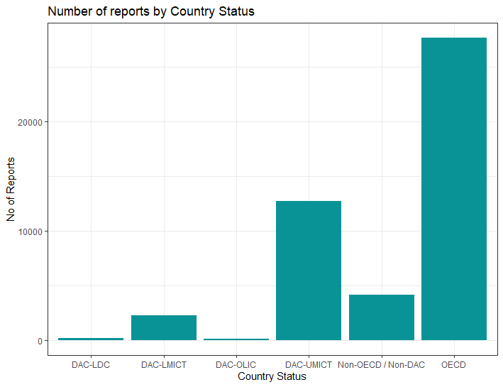

# Exploratory-Data-Analysis-EDA-R

An EDA on the dataset of corporate social responsibility reporting (CSR). 

Utilizing  ggplot2 package for R to create visualizations.  
```
install.packages("ggplot2")  
library(ggplot2)
```

After loading the data from the excel file `read.xlsx()`, data preparation and cleaning was performed in order to facilitate analysis. This included making all NA values to 0 `df[is.na(df)]<-0` and changing column titles and some item renaming.

For a more thorough evaluation to produce a more focused analysis, the functions `groupby()` and `pivot wider()` are employed.


Line Plot with multiple Lines using The functions `geom_line()`, `geom_point()`. 

&nbsp;&nbsp;&nbsp;&nbsp;*Picture 1. Historical development of CSR submitted files per region & total view of the trend.*


Small multiple can be used as an alternative of stacking or grouping. It is straightforward to make thanks to the  `facet_wrap()` function.

&nbsp;&nbsp;&nbsp;&nbsp;*Picture 2. Barchart of the CSR reports per Organization Size per Region.*


After importing the data set of the world map to join `left_join()` with our dataset to manage the creation of the map plot.  

```
mapdata<- map_data("world")
mapdata <- left_join(mapdata,Table3, by = "region")
```
&nbsp;&nbsp;&nbsp;&nbsp;*Picture 3. Map Plot of the the countries that have submitted CSR files through whole period.*


No particular geom is provided by ggplot2 to construct piecharts. The following is the trick:  
&nbsp;&nbsp;&nbsp;&nbsp;-input data frame has 2 columns: the group names(group here) and its value(value here).  
&nbsp;&nbsp;&nbsp;&nbsp;-build a stacked barchart with one bar only using the `geom_bar()` function.  
&nbsp;&nbsp;&nbsp;&nbsp;-Make it circular with `coord_polar()`  

&nbsp;&nbsp;&nbsp;&nbsp;*Pictures 4. Proportion of the Reports submitted based to Organization size*


A simple Barchart using `geom_bar()`. 

&nbsp;&nbsp;&nbsp;&nbsp;*Pictures 4.Barchart of the CSR report per Country status throw-out the years and worldwide.*



